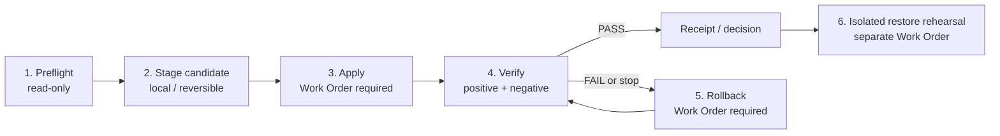

# Installation Lifecycle Profiles

Kotodamaのruntime profileは、構成ファイルだけではなく、**何を確認してから変更し、何を証拠として残し、失敗時にどう戻すか**を一つのライフサイクルとして扱います。

## 0. 読み始める場所

runtimeを起動する前に、まず会社の仕事の型と、現在の公開candidateの境界を
読みます。理想の層を読む順番は次のとおりです。

1. [Template Guide](TEMPLATE-GUIDE.md)で、Company Template、Block、
   Governed Record、MOCの役割を確認する。
2. [Company Template](../templates/company/README.md)を会社の境界と目的の
   起点として読む。
3. [Blocks](../templates/blocks/README.md)で、再利用する仕事の単位を選ぶ。
4. [Governed Records](../templates/records/README.md)で、Blockの出力をどの
   記録へ残すかを確認する。
5. [MOCs](../templates/mocs/company-operations-moc.md)で、仕事を辿る順番を
   決める。

現在の公開candidateを試す場合だけ、[Company Pack Catalog](COMPANY-PACK-CATALOG.md)
と[Starter Walkthrough](STARTER-WALKTHROUGH.md)へ進みます。ここで確認できるのは
read-only/candidate-onlyの構造と導線であり、実環境へのinstall、deploy、runtime
起動を意味しません。profileを選んでも公開状態は`NO_GO_UNPUBLISHED`のままで、
Promotion、Current Truth、Public Beta GOは別のcandidate-bound decisionです。

この公開リポジトリには、次の2つのsecret-freeな契約例があります。

| Profile | 想定用途 | 公開されているもの | 公開されていないもの |
|---|---|---|---|
| `compose_minimum` | 1台の管理対象hostで小さく試す | evidence contract、validator、data-plane skeleton、事前・適用・検証・rollback・restore手順 | secret、image取得、稼働・restart・restore receipt |
| `proxmox_segmented` | service roleとnetwork境界を分離する | sanitized role/evidence contract、validator、分離・復旧手順 | guest ID、hostname、IP、storage ID、credential、稼働receipt |

JSON例:

- [`compose-minimum.json`](../examples/installation-lifecycle/compose-minimum.json)
- [`proxmox-segmented.json`](../examples/installation-lifecycle/proxmox-segmented.json)

## 理想の導入ライフサイクルと現在の公開candidate

### 理想の導入ライフサイクル

理想的には、Company Templateと必要なBlock、Governed Record、MOCを
選んだあと、同じcandidateへ次の6フェーズを束縛します。

1. `preflight`で対象、能力、privacy境界をread-only確認する。
2. `stage_candidate`で設定、revision、digestを固定する。
3. exact Work Orderに束縛した`apply`で、限定したtargetだけへ変更する。
4. `verify`でhealth、negative test、network境界、digestを照合する。
5. 失敗または停止条件なら`rollback`し、戻ったことを再検証する。
6. 本番と隔離した場所で`restore_rehearsal`を行い、回復可能性を確認する。

この流れが完了したあとも、Promotion、Current Truth、Public Beta GOは
別のcandidate-bound decisionです。導入が成功したことだけで公開許可には
なりません。

### 現在の公開candidate

このrepositoryに同梱されているのは、secret-freeな2つのsanitized profile、
そのschema、validator、runbook、syntheticな例だけです。公開candidateで
確認できるのは、構造、参照、必要証拠の名前、stop condition、コマンドの
導線です。実環境に束縛したtarget-bound runtime receipt、image取得、起動、
restart、migration、restore、provider接続は含まれません。

したがって、現在はprofileの契約を読んでlocal候補を準備する段階です。
実環境へ進む場合は、private preflightとexact Work Orderを別に作り、
fresh receiptが揃うまで`NO_GO_UNPUBLISHED`を維持します。

## 最初に選ぶ

最初からruntimeを起動する必要はありません。Companyの仕事の型だけを
確認したい場合は、まず [Company Pack Catalog](COMPANY-PACK-CATALOG.md) と
 [Starter Walkthrough](STARTER-WALKTHROUGH.md) を読み、必要なBlock、Governed
 Record、MOCを選びます。runtime候補まで進める場合は、目的に応じて次の一つを
 選びます。

| 目的 | 選ぶprofile | 最初に行うこと | この公開例でまだ証明しないこと |
|---|---|---|---|
| 1台の管理対象hostで小さく、可逆な候補を作る | `compose_minimum` | Compose契約をvalidatorで確認し、[Compose Minimum Runbook](COMPOSE-MINIMUM-RUNBOOK.md)のpreflightへ進む | image取得、起動、restart、migration、restore、provider接続 |
| 既存のProxmox環境でservice roleとnetwork境界を分けて評価する | `proxmox_segmented` | role/evidence契約をvalidatorで確認し、[Proxmox Segmented Runbook](PROXMOX-SEGMENTED-RUNBOOK.md)のread-only inventoryへ進む | guest変更、public ingress、Voice E2E、provider転送、稼働receipt |
| まだ実環境を使わず、会社の構造だけを読む | runtime profileを選ばない | [Company Template Guide](TEMPLATE-GUIDE.md)からstarterを確認する | install、deploy、Promotion、Current Truth、Public Beta GO |

最短の読み順は次のとおりです。

1. [Company Pack Catalog](COMPANY-PACK-CATALOG.md)で、Company Template → Blocks → Governed Records → MOCsの順に候補を選ぶ。
2. [Starter Walkthrough](STARTER-WALKTHROUGH.md)で、理想の使い方と現在のread-only/candidate-only境界を確認する。
3. runtime候補が必要な場合だけ、下のvalidatorで`compose_minimum`または`proxmox_segmented`の公開契約を確認する。
4. 実環境を扱う場合は、選んだprofileのrunbookでpreflightを行い、material effectの前にexact Work Orderを作る。

validatorの`PASS`やrunbookの存在は、実行済み、稼働中、デプロイ済み、または公開可能という意味ではありません。迷った場合はruntime profileを選ばず、Company Packのread-only導線から始めます。

## 共通の6フェーズ



順序は固定です。

1. `preflight`: 現在revision、target、能力、privacy境界をread-onlyで確認する。
2. `stage_candidate`: 設定候補をlocalで作り、digestとoffline validationを残す。
3. `apply`: exact target / candidate / effect / rollbackを束縛したWork Orderだけで変更する。
4. `verify`: candidate digest、service health、negative test、network境界を照合する。
5. `rollback`: last-known-good revisionへ戻し、戻ったことも検証する。
6. `restore_rehearsal`: 本番targetと分離した場所でbackupから復元し、回復可能性を確認する。

`apply`、`rollback`、`restore_rehearsal`はmaterial effectを持つため、JSON契約では`requires_work_order: true`です。`apply.rollback_ref`は必ず`phase:rollback`を指します。

## Validator

Python標準ライブラリだけで実行できます。

```powershell
python tools\validate_installation_lifecycle.py examples\installation-lifecycle\compose-minimum.json
python tools\validate_installation_lifecycle.py examples\installation-lifecycle\proxmox-segmented.json
```

```bash
python3 tools/validate_installation_lifecycle.py examples/installation-lifecycle/compose-minimum.json
python3 tools/validate_installation_lifecycle.py examples/installation-lifecycle/proxmox-segmented.json
```

終了codeは、構造と安全契約が有効なら`0`、拒否なら`1`、使い方の誤りなら`2`です。標準出力はJSONです。

Validatorは次をfail closedで確認します。

- 6フェーズの完全な順序とeffect class
- material phaseのWork Order、applyからrollbackへのbinding
- candidate digest、health、negative test、network boundary、backup、isolated restoreの必要証拠
- Composeのproject namespace、volume inventory、config digest
- Proxmoxのlocator-only role map、segmentation、firewall digest、service identity、storage/restore証拠
- 未知field、重複JSON key、`NaN`/`Infinity`の拒否
- secret-bearing key/value、IPやguest ID等を直接書くprivate infrastructure fieldの拒否
- すべてのlive/runtime/Promotion/GO claimが`false`
- `public_beta`が`NO_GO_UNPUBLISHED`

## ContractとReceiptを混同しない

`required_evidence`と`profile_evidence`は「実行時に何を集めるか」という**契約名**です。公開例に実際のhost情報や結果は含めません。

実行時はprivateなEvidence Storeへ、少なくとも次を保存します。

- target locatorと観測時刻
- candidate revisionとSHA-256等のdigest
- exact Work Order IDと有効window
- before / after state
- 実行したcommandまたはactionの安全な要約
- health / negative / boundary testの結果
- backup digestと隔離復元の結果
- rollbackを実施したか、不要だったか、その理由

公開する場合は値そのものではなく、sanitized summary、公開可能なdigest、private receipt locatorだけを使います。

## 次に読む文書

- Compose: [Compose Minimum Runbook](COMPOSE-MINIMUM-RUNBOOK.md)
- Compose data plane: [Compose Minimum Skeleton](../runtime/compose-minimum/README.md)
- Proxmox: [Proxmox Segmented Runbook](PROXMOX-SEGMENTED-RUNBOOK.md)
- Companyの証拠鎖: [Company Template / Blocks / MOCs](TEMPLATE-GUIDE.md)
- 構造検証: [Validation](VALIDATION.md)

## Boundary

このschema、例、validator、runbookがPASSしても、install、deploy、restart、restore、provider E2Eを実行した証拠にはなりません。実環境の候補revisionに束縛されたWork Orderとfresh receiptが必要です。Promotion、Current Truth、Final Human GO、Public Beta GOは別の判断です。
