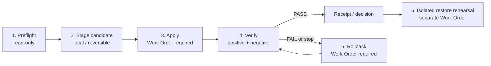

# Installation Lifecycle Profiles

Kotodamaのruntime profileは、構成ファイルだけではなく、**何を確認してから変更し、何を証拠として残し、失敗時にどう戻すか**を一つのライフサイクルとして扱います。

この公開リポジトリには、次の2つのsecret-freeな契約例があります。

| Profile | 想定用途 | 公開されているもの | 公開されていないもの |
|---|---|---|---|
| `compose_minimum` | 1台の管理対象hostで小さく試す | evidence contract、validator、data-plane skeleton、事前・適用・検証・rollback・restore手順 | secret、image取得、稼働・restart・restore receipt |
| `proxmox_segmented` | service roleとnetwork境界を分離する | sanitized role/evidence contract、validator、分離・復旧手順 | guest ID、hostname、IP、storage ID、credential、稼働receipt |

JSON例:

- [`compose-minimum.json`](../examples/installation-lifecycle/compose-minimum.json)
- [`proxmox-segmented.json`](../examples/installation-lifecycle/proxmox-segmented.json)

## 共通の6フェーズ



順序は固定です。

1. `preflight`: 現在revision、target、能力、privacy境界をread-onlyで確認する。
2. `stage_candidate`: 設定候補をlocalで作り、digestとoffline validationを残す。
3. `apply`: exact target / candidate / effect / rollbackを束縛したWork Orderだけで変更する。
4. `verify`: candidate digest、service health、negative test、network境界を照合する。
5. `rollback`: last-known-good revisionへ戻し、戻ったことも検証する。
6. `restore_rehearsal`: 本番targetと分離した場所でbackupから復元し、回復可能性を確認する。

`apply`、`rollback`、`restore_rehearsal`はmaterial effectを持つため、JSON契約では`requires_work_order: true`です。`apply.rollback_ref`は必ず`phase:rollback`を指します。

## Validator

Python標準ライブラリだけで実行できます。

```powershell
python tools\validate_installation_lifecycle.py examples\installation-lifecycle\compose-minimum.json
python tools\validate_installation_lifecycle.py examples\installation-lifecycle\proxmox-segmented.json
```

```bash
python3 tools/validate_installation_lifecycle.py examples/installation-lifecycle/compose-minimum.json
python3 tools/validate_installation_lifecycle.py examples/installation-lifecycle/proxmox-segmented.json
```

終了codeは、構造と安全契約が有効なら`0`、拒否なら`1`、使い方の誤りなら`2`です。標準出力はJSONです。

Validatorは次をfail closedで確認します。

- 6フェーズの完全な順序とeffect class
- material phaseのWork Order、applyからrollbackへのbinding
- candidate digest、health、negative test、network boundary、backup、isolated restoreの必要証拠
- Composeのproject namespace、volume inventory、config digest
- Proxmoxのlocator-only role map、segmentation、firewall digest、service identity、storage/restore証拠
- 未知field、重複JSON key、`NaN`/`Infinity`の拒否
- secret-bearing key/value、IPやguest ID等を直接書くprivate infrastructure fieldの拒否
- すべてのlive/runtime/Promotion/GO claimが`false`
- `public_beta`が`NO_GO_UNPUBLISHED`

## ContractとReceiptを混同しない

`required_evidence`と`profile_evidence`は「実行時に何を集めるか」という**契約名**です。公開例に実際のhost情報や結果は含めません。

実行時はprivateなEvidence Storeへ、少なくとも次を保存します。

- target locatorと観測時刻
- candidate revisionとSHA-256等のdigest
- exact Work Order IDと有効window
- before / after state
- 実行したcommandまたはactionの安全な要約
- health / negative / boundary testの結果
- backup digestと隔離復元の結果
- rollbackを実施したか、不要だったか、その理由

公開する場合は値そのものではなく、sanitized summary、公開可能なdigest、private receipt locatorだけを使います。

## 次に読む文書

- Compose: [Compose Minimum Runbook](COMPOSE-MINIMUM-RUNBOOK.md)
- Compose data plane: [Compose Minimum Skeleton](../runtime/compose-minimum/README.md)
- Proxmox: [Proxmox Segmented Runbook](PROXMOX-SEGMENTED-RUNBOOK.md)
- Companyの証拠鎖: [Company Template / Blocks / MOCs](TEMPLATE-GUIDE.md)
- 構造検証: [Validation](VALIDATION.md)

## Boundary

このschema、例、validator、runbookがPASSしても、install、deploy、restart、restore、provider E2Eを実行した証拠にはなりません。実環境の候補revisionに束縛されたWork Orderとfresh receiptが必要です。Promotion、Current Truth、Final Human GO、Public Beta GOは別の判断です。
