# Company Starter Walkthrough

この手順は、公開starterを自分の会社・チーム用の**候補pack**として試すためのものです。約3分、Python標準ライブラリだけで構造検証できます。

## 0. まず層を読む

初めてstarterを試すときは、runtimeを起動せず、理想のCompany OSと現在の
公開candidateを分けてからinitializerへ進みます。

**理想**では、次の順に会社の境界から証拠の形へ進みます。

[Company Template](../templates/company/README.md) →
[Blocks](../templates/blocks/README.md) →
[Governed Records](../templates/records/README.md) →
[MOCs](../templates/mocs/README.md)

**現在**の公開previewでは、[Company Pack Catalog](COMPANY-PACK-CATALOG.md)で
shipped starterの対応を一覧し、[Public Preview Self-check](PUBLIC-PREVIEW-SELF-CHECK.md)
でlocal / synthetic候補の状態を確認してから、下のinitializerで新しい作業copyを
作ります。Catalog、Self-check、initializerはすべてread-only/candidate-onlyの
導線で、公開状態は`NO_GO_UNPUBLISHED`です。Human approval、runtime、Promotion、
Current Truth、Voice / Discord E2Eはこの手順から導出されません。

## 実行確認: Runbook smoke

The one-command smoke continues beyond the Review Bundle: it saves and verifies
Review Request, Review Response, and Decision Handoff artifacts inside one OS
temporary pack, runs all 13 existing Company Pack CLIs, deletes the temporary
workspace, and only then emits its closed JSON report.

```powershell
python -S -B tools/smoke_company_pack_review_chain.py
```

```bash
python3 -S -B tools/smoke_company_pack_review_chain.py
```

The separate regression interface is
[`test_public_starter_runbook_smoke.py`](../tests/test_public_starter_runbook_smoke.py).
This **full review-chain smoke** is external-free and candidate-only; it keeps
`NO_GO_UNPUBLISHED` and does not create Human approval, runtime authority,
Promotion, Current Truth, or Public Beta GO.

repository rootから、追加依存なしのregression自体を確認する場合は次を実行します。

```powershell
python -m unittest tests.test_public_starter_runbook_smoke -v
```

```bash
python3 -m unittest tests.test_public_starter_runbook_smoke -v
```

最初に導入順そのものを確認したい場合は、[Schema / Validator / Test Matrix](SCHEMA-VALIDATOR-MATRIX.md) の Runbook smoke と [test_public_starter_runbook_smoke.py](../tests/test_public_starter_runbook_smoke.py) を参照してください。外部接続なしの一時directoryで、initializer → validator → Catalog → customization → Public Preview → Next Steps → Review Bundle → Review Request → Review Response → Review Decision Handoff → verify を通せます。

- guided path: 3つの静的値を指定した新規Packで `CANDIDATE_FOR_GOVERNED_REVIEW` と `MATCH` まで進む
- plain path: 2引数initializerは `CUSTOMIZATION_REQUIRED` のまま `BUNDLE_REFUSED` で止まる。拒否JSONを成功bundleとして保存しない
- どちらも `read-only/candidate-only`、`NO_GO_UNPUBLISHED`。Human approval、runtime、Promotion、Current Truth、Public Beta GOは作らない

## 1. initializerで作業copyを作る

repository rootから実行します。

```powershell
New-Item -ItemType Directory -Force work | Out-Null
python tools\create_company_pack.py my-company work\my-company
```

```bash
mkdir -p work
python3 tools/create_company_pack.py my-company work/my-company
```

initializerはPython標準ライブラリだけで動き、次を一度に行います。

- 元のexampleを変更せず、新しいtargetへcopyする
- manifestのpack IDと、manifest内MOCの先頭refを同じIDへ再束縛する
- manifest、9 Blocks、3 MOCs、9 Recordsを安全な作業状態`draft`へ変更する
- 生成packをvalidatorで検証する
- targetが既に存在する場合は上書きせず停止する
- 生成途中で失敗した場合は、この実行が新規作成したtargetだけを除去する

3つの組織固有値が決まっている場合は、[guided initializer](GUIDED-COMPANY-PACK-INITIALIZATION.md)を使うと、Human Intent locator 1件、Block expiry 9件、Record retention policy locator 9件も同じ新規作成内で反映できます。通常の2引数commandは変更されず、値をまだ決めていない場合に、公開starterでは19件となる静的placeholderを残して作業を始めるpathです。Packを縮小・拡張した場合は、実行結果の件数を使います。

targetの親directoryは先に作成してください。既存の作業copyを更新するコマンドではありません。

手動でcopyする場合は、元のexampleを直接書き換えず、`manifest.json`とmanifest内の全MOCを一緒に変更してください。

## 2. manifestで正本の場所を決める

initializerが`id`を設定した後、`work/my-company/manifest.json`で最初に確認・変更するのは次の3点です。

| Field | 書くもの | 書かないもの |
|---|---|---|
| `id` | 小文字・数字・hyphenのpack ID | 会社の秘密名や個人情報 |
| `human_intent_ref` | governed Human Intent recordの参照名 | Human Intent本文やtoken |
| `canonical_owners` | fact familyごとの正本owner/保存先 | 同じfactの競合する正本 |

`human_intent_ref`はlocatorのplaceholderです。このvalidatorは参照先の存在、真正性、承認を確認しません。

後から`id`を変更する場合は、manifest内に列挙された全MOCの先頭refも同じIDへ変更します。MOCの参照先が存在しなければvalidatorはfail closedします。initializerを再実行して既存targetを上書きすることはできません。

## 3. customization checklistとguided planを実行する

```powershell
python tools\check_company_pack_customization.py work\my-company
python tools\plan_company_pack_next_steps.py work\my-company --format markdown
python tools\check_company_pack_public_preview.py work\my-company
python tools\check_company_pack_public_preview.py work\my-company --format markdown
```

POSIX shellでは同じ候補Packの現在地・次の一手・公開preview境界を確認できます。

```bash
python3 tools/check_company_pack_customization.py work/my-company
python3 tools/plan_company_pack_next_steps.py work/my-company --format markdown
python3 tools/check_company_pack_public_preview.py work/my-company
python3 tools/check_company_pack_public_preview.py work/my-company --format markdown
```

作成直後は`CUSTOMIZATION_REQUIRED`で終了し、公開starterでは19件を返します。これは失敗ではなく、組織固有のHuman Intent locator 1件、Block expiry 9件、Record retention policy 9件がまだexampleであることを示します。別のPackではcheckerが返した実際の件数が基準です。

guided initializerで公開starterを作成した場合は`READY_FOR_GOVERNED_REVIEW`、`0/46/5`から始まります。0は静的placeholderだけで、46のgoverned reviewと5の外部evidenceは残ります。これはstarterの例であり、review request以降のbuilder/verifierは保存済みreportの実際の件数へ追従します。

`review_required`のowner・profile・roleは、文字列を変更すれば承認済みになるものではありません。`evidence_required`も静的CLIでは閉じません。詳細は[Company Pack Customization Checklist](CUSTOMIZATION-CHECKLIST.md)を参照してください。

checkerの一件ずつのJSONが長い場合、guided plannerは同じ結果を現在地、理想の7段階、分類別件数、次の一手へ集約します。作成直後の現在地は`STATIC_CUSTOMIZATION`で、Human Intent locator 1件、Block authority window 9件、Governed Record retention policy 9件が表示されます。plannerのexit code `0`は案内の生成成功であり、placeholder完了や承認ではありません。詳しくは[Company Pack Guided Next Steps](COMPANY-PACK-NEXT-STEPS.md)を参照してください。

作成直後または編集後の作業copyを、Block、Record、MOCの読み順として確認する
場合は、次のread-only Catalogを実行します。

~~~powershell
python tools\catalog_company_pack.py work\my-company --format markdown
~~~

```bash
python3 tools/catalog_company_pack.py work/my-company --format markdown
```

Catalogは現在地を短く投影するだけで、placeholder完了、Human approval、
runtime、Promotion、Current Truth、Public Beta GOを作りません。契約とJSON
出力の詳細は[Company Pack Catalog](COMPANY-PACK-CATALOG.md)を参照してください。

## 4. review対象のbytesを固定する

`replacement_required`を0にしてcheckerが`READY_FOR_GOVERNED_REVIEW`になったら、次を実行します。

```powershell
python tools\build_company_pack_review_bundle.py work\my-company
```

```bash
python3 tools/build_company_pack_review_bundle.py work/my-company
```

出力はmanifest、9 Blocks、3 MOCs、9 Recordsのpath、SHA-256、byte sizeと、binding全体のdigestを持ちます。同じbytesなら同じbundleになり、1 byteでも変わればdigestが変わります。これはreview対象を固定するだけで、Human approval、authority、Promotion、Current Truth、runtime readiness、Public Beta GOを作りません。詳しくは[Company Pack Review Bundle](REVIEW-BUNDLE.md)を参照してください。

bundleを保存して別reviewerへ渡す場合は[Candidate-bound Review Workflow](REVIEW-WORKFLOW.md)に従います。`verify_company_pack_review_bundle.py`の`MATCH`はsaved metadata/digestと現在bytesの一致であり、reviewerの判断そのものではありません。

`MATCH`したbundleとPackから、保存済みcustomization reportの個別review itemを手転記なしで依頼へまとめるには[Company Pack Review Request](REVIEW-REQUEST.md)を使います。公開starterの例は46件ですが、recordless Packのように構成が異なる場合は実際のitem countへ変わります。出力は`PENDING_AUTHORIZED_REVIEW`かつ`selected_outcome=null`で、evidence gapも未解決のまま分離します。

requestへID/path/reasonを再入力せずoutcomeを記録するには[Company Pack Review Response Candidate](REVIEW-RESPONSE.md)を使います。response verifierは元requestのbindingと実際のitem countへ構造一致させますが、reviewer identity、authority、approval、全体outcome、Decision Recordは別stepです。

responseまで完了した5成果物をHuman Decisionへ渡すには[Review Evidence to Decision Handoff](REVIEW-DECISION-HANDOFF.md)を使います。handoffはexact bytesを固定するだけで、Decision、identity、authority、GOを作りません。

Source ItemをIntent抽出前のprivate shapeへ閉じるには[Company Pack Source Record Instance Contract](SOURCE-RECORD-INSTANCE.md)を使います。source bodyや実recordを公開せず、locator/hashをauthenticityへ昇格しません。

保存済みR31 recordと別保存のcontentをlocalで照合する必要がある場合は[Source Binding Verification Candidate](SOURCE-BINDING-VERIFIER-CANDIDATE.md)を使います。private inputをrepositoryへ置かず、point-in-time candidate matchをatomic snapshotやconsent verificationへ昇格しません。

protected runnerのreceipt fieldを設計するときは[Protected Source Binding Receipt Candidate](PROTECTED-SOURCE-BINDING-RECEIPT-CANDIDATE.md)を使います。これはunpopulated schema-only契約であり、private evidenceやaudio/transcriptをstarterへ追加せず、shape validationをprotected executionへ昇格しません。

Sourceから抽出した意図候補をHuman確認前のprivate shapeへ閉じるには[Company Pack Intent Candidate Instance Contract](INTENT-CANDIDATE-INSTANCE.md)を使います。source bodyや実candidateを公開せず、schema PASSをHuman Intentへ昇格しません。

実Decisionを作る前に記録fieldと否定claimを確認するには[Company Pack Decision Record Candidate Contract](DECISION-RECORD-CANDIDATE.md)を使います。これはschema-only契約であり、Decision、承認、権限、Promotion、GOを生成しません。

## Review-chain artifact map

Use this map before or after the external-free smoke when you need to understand what is
saved and where the next handoff begins. Each row is a candidate artifact or
its fresh verification; none of these states is a Human Decision.

| Artifact | Input / saved output | Builder / verifier | Expected candidate state | Next handoff |
|---|---|---|---|---|
| Review Bundle | current Pack → `work/my-company-review-bundle.json` | `build_company_pack_review_bundle.py` / `verify_company_pack_review_bundle.py` | `MATCH` | Review Request |
| Review Request | saved Bundle + current Pack → `work/my-company-review-request.json` | `build_company_pack_review_request.py` | `PENDING_AUTHORIZED_REVIEW`, `selected_outcome: null` | Review Response |
| Review Response | saved Request → `work/my-company-review-response.json` (edit outcomes/notes only) | `build_company_pack_review_response.py` / `verify_company_pack_review_response.py` | `ITEM_RESPONSES_MATCH_REQUEST` | Review Decision Handoff |
| Review Decision Handoff | Bundle, Request, Response, verifications, current Pack → `work/my-company-review-decision-handoff.json` | `build_company_pack_review_decision_handoff.py` / `verify_company_pack_review_decision_handoff.py` | `DECISION_HANDOFF_MATCH`, `decision: null`, `selected_outcome: null` | separate Human Decision |

The saved files preserve exact bindings and dynamic item counts. The map is
`read-only/candidate-only`; all claims remain false and
`NO_GO_UNPUBLISHED` remains in force. Human approval, reviewer identity,
authority, Promotion, Current Truth, runtime, and Public Beta GO are separate
gates and are not created by these builders or verifiers.

## 5. flow contractとMOC順にBlockを読む

`manifest.json`の`flow`は、外部から入る`entry_inputs`、Block IDの`sequence`、読み順を示す`moc_ref`を宣言します。[`company-operations.json`](../examples/company-starter/mocs/company-operations.json)は、同じ順序を示すnavigation projectionです。

```mermaid
flowchart LR
  S["Source Intake"] --> I["Intent Candidate"]
  I --> D["Human Decision record"]
  D --> W["Work Order candidate"]
  W --> G["Capability Grant candidate"]
  G --> X["Change Candidate"]
  X --> V["Verification Receipt"]
  V --> P["Promotion Candidate"]
  P --> H["Human Promotion Decision"]
  H -. "separate governed Promotion" .-> C["Current Truth"]
```



MOCはDecision、Promotion、Current Truthを変更しません。

目的別の入口として、[`public-release.json`](../examples/company-starter/mocs/public-release.json)と[`incident-recovery.json`](../examples/company-starter/mocs/incident-recovery.json)もあります。これらは新しい実行フローではなく、同じBlock鎖から必要箇所だけを辿るnavigation projectionです。

validatorは、sequenceがmanifest内の全Blockをちょうど1回含むこと、各Blockの入力がentry inputまたは前段Blockの出力に存在すること、primary MOCが同じ完全順序を持つこと、`projection: flow_subsequence`を明示したsecondary MOCがmanifest IDから始まる同順序の部分列であることを確認します。

## 6. Block出力とRecord契約を合わせる

`manifest.json`の`records`は、各Blockの`outputs`を受け取るGoverned Recordテンプレートを列挙します。Recordの`artifact`は全Block出力を重複なく一度ずつ覆う必要があります。

- `required_fields`: 実Recordを作るときに必ず保持する項目
- `canonical_owner`: そのfact familyの正本を持つ場所または役割
- `authority`: 作成役、検証役、Current Truthに必要な別Promotion
- `retention.policy_ref`: 値そのものではなく組織の保持方針への参照
- `denied_claims`: 自己承認、自己Promotion、PromotionなしのCurrent Truth化を禁止

このstarterのRecordはデータ入力フォームではなく契約例です。実データ、secret、個人情報を公開packへ直接書かないでください。

## 7. Blockを自分の運用へ合わせる

各Blockで必ず確認します。

- `inputs` / `outputs`: 前後のrecord名がつながっているか
- `authority`: owner、許可action、拒否action、期限が具体的か
- `verification`: successだけでなくnegative testがあるか
- `rollback`: 失敗時に何を戻し、何が変わっていないと確認するか
- `stop_conditions`: 不明点やdriftで安全に止まるか

例の`2099-01-01`は書式を示すplaceholderです。実運用では短い作業windowに置き換えます。

## 8. validatorを実行する

```powershell
python tools\validate_template_pack.py work\my-company
```

```bash
python3 tools/validate_template_pack.py work/my-company
```

成功例:

```json
{"errors": [], "pack_id": "my-company", "status": "PASS", "validated_files": 22}
```

## 9. PASSの意味を狭く保つ

PASSが示すのは、pack構造、参照、限定authority、secretらしい値、必須denialなどの検査結果です。次は証明しません。

- Humanが意図・Decision・Promotionを承認したこと
- 外部providerやruntimeが安全に動くこと
- rollbackや削除が実環境で成功すること
- Current Truthが変更されたこと
- Public Beta GO

実行やPromotionへ進む場合は、対象revisionを固定したWork Order、実結果のVerification Receipt、必要な独立承認を別途用意します。

## よくある失敗

| Error | 確認すること |
|---|---|
| `unsafe relative path` | pack外参照、空白、絶対pathを使っていないか |
| `references unknown id` | MOCのIDと各JSONの`id`が一致しているか |
| `has unavailable input` | `flow.sequence`の前段出力または`entry_inputs`が不足していないか |
| `must contain every manifest block` | sequenceからBlockが欠落・重複していないか |
| `refs must equal manifest id followed by flow sequence` | MOCとflowの順序が一致しているか |
| `secondary MOC ... ordered subsequence` | 目的別MOCがpack IDから始まり、同じBlock順序だけを参照しているか |
| `forbidden allowed action` | Blockが公開safe allowlistを越えていないか |
| `secret-bearing key is forbidden` | secret値ではなく安全な参照名へ置換したか |
| `public_beta must remain NO_GO_UNPUBLISHED` | template自身にGOを宣言させていないか |

validatorの完全な境界は[Template Pack Validation](VALIDATION.md)を参照してください。
