# Company Starter Walkthrough

この手順は、公開starterを自分の会社・チーム用の**候補pack**として試すためのものです。約3分、Python標準ライブラリだけで構造検証できます。

## 1. initializerで作業copyを作る

repository rootから実行します。

```powershell
New-Item -ItemType Directory -Force work | Out-Null
python tools\create_company_pack.py my-company work\my-company
```

```bash
mkdir -p work
python3 tools/create_company_pack.py my-company work/my-company
```

initializerはPython標準ライブラリだけで動き、次を一度に行います。

- 元のexampleを変更せず、新しいtargetへcopyする
- manifestのpack IDと、manifest内MOCの先頭refを同じIDへ再束縛する
- manifest、9 Blocks、3 MOCs、9 Recordsを安全な作業状態`draft`へ変更する
- 生成packをvalidatorで検証する
- targetが既に存在する場合は上書きせず停止する
- 生成途中で失敗した場合は、この実行が新規作成したtargetだけを除去する

targetの親directoryは先に作成してください。既存の作業copyを更新するコマンドではありません。

手動でcopyする場合は、元のexampleを直接書き換えず、`manifest.json`とmanifest内の全MOCを一緒に変更してください。

## 2. manifestで正本の場所を決める

initializerが`id`を設定した後、`work/my-company/manifest.json`で最初に確認・変更するのは次の3点です。

| Field | 書くもの | 書かないもの |
|---|---|---|
| `id` | 小文字・数字・hyphenのpack ID | 会社の秘密名や個人情報 |
| `human_intent_ref` | governed Human Intent recordの参照名 | Human Intent本文やtoken |
| `canonical_owners` | fact familyごとの正本owner/保存先 | 同じfactの競合する正本 |

`human_intent_ref`はlocatorのplaceholderです。このvalidatorは参照先の存在、真正性、承認を確認しません。

後から`id`を変更する場合は、manifest内に列挙された全MOCの先頭refも同じIDへ変更します。MOCの参照先が存在しなければvalidatorはfail closedします。initializerを再実行して既存targetを上書きすることはできません。

## 3. customization checklistを実行する

```powershell
python tools\check_company_pack_customization.py work\my-company
```

作成直後は`CUSTOMIZATION_REQUIRED`で終了し、通常は19件を返します。これは失敗ではなく、組織固有のHuman Intent locator 1件、Block expiry 9件、Record retention policy 9件がまだexampleであることを示します。

`review_required`のowner・profile・roleは、文字列を変更すれば承認済みになるものではありません。`evidence_required`も静的CLIでは閉じません。詳細は[Company Pack Customization Checklist](CUSTOMIZATION-CHECKLIST.md)を参照してください。

## 4. flow contractとMOC順にBlockを読む

`manifest.json`の`flow`は、外部から入る`entry_inputs`、Block IDの`sequence`、読み順を示す`moc_ref`を宣言します。[`company-operations.json`](../examples/company-starter/mocs/company-operations.json)は、同じ順序を示すnavigation projectionです。

```mermaid
flowchart LR
  S["Source Intake"] --> I["Intent Candidate"]
  I --> D["Human Decision record"]
  D --> W["Work Order candidate"]
  W --> G["Capability Grant candidate"]
  G --> X["Change Candidate"]
  X --> V["Verification Receipt"]
  V --> P["Promotion Candidate"]
  P --> H["Human Promotion Decision"]
  H -. "separate governed Promotion" .-> C["Current Truth"]
```



MOCはDecision、Promotion、Current Truthを変更しません。

目的別の入口として、[`public-release.json`](../examples/company-starter/mocs/public-release.json)と[`incident-recovery.json`](../examples/company-starter/mocs/incident-recovery.json)もあります。これらは新しい実行フローではなく、同じBlock鎖から必要箇所だけを辿るnavigation projectionです。

validatorは、sequenceがmanifest内の全Blockをちょうど1回含むこと、各Blockの入力がentry inputまたは前段Blockの出力に存在すること、primary MOCが同じ完全順序を持つこと、`projection: flow_subsequence`を明示したsecondary MOCがmanifest IDから始まる同順序の部分列であることを確認します。

## 5. Block出力とRecord契約を合わせる

`manifest.json`の`records`は、各Blockの`outputs`を受け取るGoverned Recordテンプレートを列挙します。Recordの`artifact`は全Block出力を重複なく一度ずつ覆う必要があります。

- `required_fields`: 実Recordを作るときに必ず保持する項目
- `canonical_owner`: そのfact familyの正本を持つ場所または役割
- `authority`: 作成役、検証役、Current Truthに必要な別Promotion
- `retention.policy_ref`: 値そのものではなく組織の保持方針への参照
- `denied_claims`: 自己承認、自己Promotion、PromotionなしのCurrent Truth化を禁止

このstarterのRecordはデータ入力フォームではなく契約例です。実データ、secret、個人情報を公開packへ直接書かないでください。

## 6. Blockを自分の運用へ合わせる

各Blockで必ず確認します。

- `inputs` / `outputs`: 前後のrecord名がつながっているか
- `authority`: owner、許可action、拒否action、期限が具体的か
- `verification`: successだけでなくnegative testがあるか
- `rollback`: 失敗時に何を戻し、何が変わっていないと確認するか
- `stop_conditions`: 不明点やdriftで安全に止まるか

例の`2099-01-01`は書式を示すplaceholderです。実運用では短い作業windowに置き換えます。

## 7. validatorを実行する

```powershell
python tools\validate_template_pack.py work\my-company
```

```bash
python3 tools/validate_template_pack.py work/my-company
```

成功例:

```json
{"errors": [], "pack_id": "my-company", "status": "PASS", "validated_files": 22}
```

## 8. PASSの意味を狭く保つ

PASSが示すのは、pack構造、参照、限定authority、secretらしい値、必須denialなどの検査結果です。次は証明しません。

- Humanが意図・Decision・Promotionを承認したこと
- 外部providerやruntimeが安全に動くこと
- rollbackや削除が実環境で成功すること
- Current Truthが変更されたこと
- Public Beta GO

実行やPromotionへ進む場合は、対象revisionを固定したWork Order、実結果のVerification Receipt、必要な独立承認を別途用意します。

## よくある失敗

| Error | 確認すること |
|---|---|
| `unsafe relative path` | pack外参照、空白、絶対pathを使っていないか |
| `references unknown id` | MOCのIDと各JSONの`id`が一致しているか |
| `has unavailable input` | `flow.sequence`の前段出力または`entry_inputs`が不足していないか |
| `must contain every manifest block` | sequenceからBlockが欠落・重複していないか |
| `refs must equal manifest id followed by flow sequence` | MOCとflowの順序が一致しているか |
| `secondary MOC ... ordered subsequence` | 目的別MOCがpack IDから始まり、同じBlock順序だけを参照しているか |
| `forbidden allowed action` | Blockが公開safe allowlistを越えていないか |
| `secret-bearing key is forbidden` | secret値ではなく安全な参照名へ置換したか |
| `public_beta must remain NO_GO_UNPUBLISHED` | template自身にGOを宣言させていないか |

validatorの完全な境界は[Template Pack Validation](VALIDATION.md)を参照してください。
