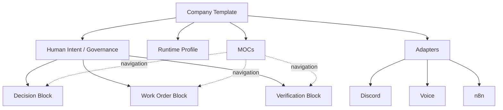
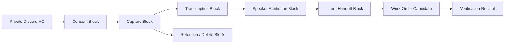

# Company Template / Blocks / MOCs の使い方

Kotodama のテンプレートは、AIに会社を丸ごと任せるための完成品ではありません。人間の意図、権限、実行、検証を見失わずに、会社やプロジェクトの運営方法を再利用するための部品です。

この文書では、会話で使われていた「Mox」を **MOCs（Maps of Content、モックス）** と解釈しています。MOCは複数の文書やBlockへ案内する地図であり、データの正本ではありません。

## 4つのテンプレート層

| 層 | 役割 | たとえるなら |
|---|---|---|
| Company Template | 会社・チーム全体の運営構造を複製する | 建物全体の設計図 |
| Block | 入力・出力・権限・検証を持つ小さな再利用部品 | 部屋や設備 |
| MOC | 関係する文書とBlockを目的別に案内する | 館内案内図 |
| Governed Record | Block出力の必須field、owner、検証・保持境界を定義する | 監査可能な伝票 |



## 最初に読む順番: ideal → current → smoke

このガイドは、理想のCompany OSと現在の公開candidateを同じ順番で読み分ける
`ideal/current`の入口です。

1. ideal: [Company Template](../templates/company/README.md) → [Blocks](../templates/blocks/README.md) → [Governed Records](../templates/records/README.md) → [MOCs](../templates/mocs/README.md) の層と責任を読む。
2. current: [Company Pack Catalog](COMPANY-PACK-CATALOG.md) で、公開starterに実際に含まれるBlock、Record、MOCを一覧し、[Company Pack Guided Next Steps](COMPANY-PACK-NEXT-STEPS.md) で現在stageから次の候補作業へ進む。
3. smoke: [Starter Walkthrough](STARTER-WALKTHROUGH.md) のRunbook smoke、または [test_public_starter_runbook_smoke.py](../tests/test_public_starter_runbook_smoke.py) で、外部接続なしの導入順を確認する。

- guided pathは `CANDIDATE_FOR_GOVERNED_REVIEW` から保存済みbundleの `MATCH` まで進む。
- plain pathは `CUSTOMIZATION_REQUIRED` のまま `BUNDLE_REFUSED` で停止し、拒否JSONを成功bundleとして保存しない。
- どちらも `read-only/candidate-only`、`NO_GO_UNPUBLISHED`。Human approval、runtime、Promotion、Current Truth、Public Beta GOは作らない。

## Current candidate runbook smoke

公開starterを実際に試すときは、`examples/company-starter`をimmutableな基準として
読み、生成した`work/my-company`だけを編集します。次の最初のcheckerは、未編集の
placeholderが残るため通常`CUSTOMIZATION_REQUIRED`で停止します。これは想定された
候補の停止点であり、成功bundleではありません。plain pathをそのままbundleへ渡すと
`BUNDLE_REFUSED`になります。

PowerShellでは、まず作業copyを作って停止点を確認します。

~~~powershell
python tools\create_company_pack.py my-company work\my-company
python tools\check_company_pack_customization.py work\my-company
~~~

POSIX shellでも同じcandidate pathを使います。

~~~bash
python3 tools/create_company_pack.py my-company work/my-company
python3 tools/check_company_pack_customization.py work/my-company
~~~

checkerのreportを読み、組織固有のplaceholderを`work/my-company`側だけで置き換え、
`replacement_required: 0`になったことを確認して**編集後に再実行**します。その後の
Catalog、validator、Public Preview Self-check、Review Bundleの順番は次のとおりです。

~~~powershell
python tools\catalog_company_pack.py work\my-company --format markdown
python tools\validate_template_pack.py work\my-company
python tools\check_company_pack_public_preview.py work\my-company --format markdown
python tools\build_company_pack_review_bundle.py work\my-company
~~~

~~~bash
python3 tools/catalog_company_pack.py work/my-company --format markdown
python3 tools/validate_template_pack.py work/my-company
python3 tools/check_company_pack_public_preview.py work/my-company --format markdown
python3 tools/build_company_pack_review_bundle.py work/my-company
~~~

このrunbookは、ideal/current/smokeを一つのcandidateで追跡するためのものです。
Catalog、validator、Self-check、Review BundleのPASS/MATCHは、bytesと構造を確認する
local evidenceであり、Human approval、execution authority、runtime activation、
Promotion、Current Truth、Voice/Discord E2E、Public Beta GOを作りません。公開経路は
常に`read-only/candidate-only`、状態は`NO_GO_UNPUBLISHED`です。

## 理想としての使い方

### 1. Company Templateを選ぶ

最初に、誰が何のために使う会社・チームなのかを決めます。その上で実行環境を選びます。

- Minimum profile: 1台のPCとDocker Composeで試す
- Segmented profile: Proxmox上でVoice、DB、workflow、AIを分離する

Company Templateには、Human Intent、Decision、Work Order、Capability Grant、Verification Receipt、Promotion、Current Truthの置き場所と関係を含めます。

### 2. 必要なBlockだけを組み合わせる

Blockは、一つの責任を持つ小さなテンプレートです。すべてのBlockは、少なくとも次を宣言します。

- 何を入力として受け取るか
- 何を出力するか
- 誰の権限で動くか
- 何をしてはいけないか
- 何をもって成功とするか
- 失敗時にどう停止・rollbackするか
- どのreceiptを残すか

たとえばVoiceでは、Capture、Consent、Transcription、Speaker Attribution、Intent Handoff、Retention/Deleteを別Blockとして扱います。文字起こしできたことだけで、公開・保存・再利用の権限を得ることはありません。

### 3. MOCで仕事の入口を作る

MOCは「この仕事を始めるとき、何をどの順番で読むか」を示します。

以下は、理想のCompany OSで考えられる概念的な導線候補です。
**Conceptual ideal/future MOC candidates (not shipped starter files):**

例:

- Company Operations MOC
- Voice Operations MOC
- Public Release MOC
- Incident / Recovery MOC
- Venture / Customer Discovery MOC

MOCからDecisionやCurrent Truthを直接変更しません。MOCはリンクと現在地を示すProjectionです。

**The public starter currently ships exactly three MOCs:**

公開starterでは、同じcanonical Block鎖に対して3つの入口を用意しています。

| MOC | 使う場面 | 現在の範囲 |
|---|---|---|
| Company Operations | 全体の流れを最初から読む | 9 Blockの完全な読み順 |
| Public Release Review | 公開候補をDecisionから検証する | Human DecisionからPromotion Decisionまでの部分列 |
| Incident / Recovery | boundedな停止・復旧候補を辿る | Work OrderからVerification Receiptまでの部分列 |

目的別MOCは新しい記録や正本を持ちません。公開例は`projection: flow_subsequence`を明示し、manifest IDから始まり、canonical flowと同じ順序のBlockだけを参照することをvalidatorが確認します。

Block、Record、MOCを編集する前に、Company Pack Catalogで現在の対応を一覧できます。

~~~powershell
python tools/catalog_company_pack.py examples/company-starter --format markdown
python tools/check_company_pack_public_preview.py examples/company-starter
python tools/check_company_pack_public_preview.py examples/company-starter --format markdown
~~~

~~~bash
python3 tools/catalog_company_pack.py examples/company-starter --format markdown
python3 tools/check_company_pack_public_preview.py examples/company-starter
python3 tools/check_company_pack_public_preview.py examples/company-starter --format markdown
~~~

CatalogとSelf-checkはread-onlyのnavigation / preview projectionです。出力のPASSは構造を読めた
ことだけを示し、Human approval、Capability Grant、runtime、Promotion、
Current Truth、Public Beta GOを作りません。JSON Schemaに対して機械処理する
場合や、無効packの終了codeを扱う場合は[Company Pack Catalog](COMPANY-PACK-CATALOG.md)
と[Public Preview Self-check](PUBLIC-PREVIEW-SELF-CHECK.md)を参照してください。

### 4. すべてを同じ証拠鎖に通す

```text
Source Evidence
  -> Intent Candidate
  -> Human or Policy Decision
  -> Work Order + Capability Grant
  -> Change Candidate
  -> Verification Receipt
  -> Promotion
  -> Current Truth
```

会話、Discord投稿、音声、Notion、Obsidianは入口や表示面として使えますが、それだけでDecisionやCurrent Truthにはなりません。

各Blockの`outputs`は、manifestの`records`にあるGoverned Recordの`artifact`へ一対一で接続します。公開starterでは9種を用意していますが、これは本番データではなく記録契約です。Work OrderとCapability Grant、Promotion CandidateとHuman Promotion Decisionを別Recordにし、権限と判断を暗黙に補完しません。詳細は[Governed Record Catalog](../templates/records/README.md)を参照してください。

### 5. 検証できる状態で配布する

完成したテンプレートは、READMEだけではなく、schema、validator、test、runbook、サンプル、rollback手順を一緒に配布します。秘密情報は値ではなく参照名やplaceholderに置き換えます。公開starterの対応表は[Schema / Validator / Test Matrix](SCHEMA-VALIDATOR-MATRIX.md)で確認できます。

## Voiceから仕事になるまでの例



理想形では、15分ごとのrotationと投稿、話者情報、handoff、削除期限が同じrun IDで追跡できます。失敗した場合は後段へ進まず、何が実行されなかったかもreceiptに残します。

## 現在は実際にどうしているか

### 公開リポジトリで使えるもの

- プロジェクトの目的、現在状態、ロードマップ
- このテンプレート利用ガイド
- Source Intake、Intent Candidate、Human Decision、Work Order、Capability Grant、Change Execution、Verification Receipt、Promotion Gate、Promotion Decisionを含むCompany starter
- Company Operations、Public Release Review、Incident / Recoveryの3つのnavigation-only MOC
- sourceを保ったまま公開starterの22文書を`draft`化し、任意のall-or-none guided optionで19静的fieldも一括反映するinitializer、置換・review・evidenceを分離するcustomization checker、現在地・理想・次の一手をJSON/Markdownへ集約するguided planner、review対象bytesを固定して再照合するbundle builder/verifier、Packごとの実際の件数（公開starterの例は46件）を再入力せずpending requestとitem response candidateへ運び構造照合するbuilder/verifier
- Company manifest、Block、MOC、Governed Recordのschema、validator、negative tests
- Compose minimum / Proxmox segmentedの6フェーズinstallation lifecycle契約、validator、公開runbook
- Compose minimumのCompany DB / Evidence metadata Store data-plane skeletonとexact-byte validator
- [A017階層テンプレート候補](../templates/hierarchy/README.md): project、phase、requirement、plan、task、session contextを8つの公開safeなdestinationへ再構成し、exact 10-source manifestと標準ライブラリvalidatorで検査。Issue #25、private source-history receipt、独立reviewが閉じるまではadmission不可

これらは構造検証できるstarterです。Compose data-planeはofflineで解決できる実行候補まで進みましたが、image取得・起動・migration・restart・restoreのlive receiptやCompany OS一式ではありません。実際の使い始め方は[Starter Walkthrough](STARTER-WALKTHROUGH.md)、runtime境界は[Installation Lifecycle Profiles](INSTALLATION-LIFECYCLE.md)を参照してください。

### ローカルで実装・検証しているもの

- 合成Discord textまたは正規化済みの合成voice transcriptを入力にしたCompany OSの垂直スライス
- Source RecordからIntent Candidate、idea、review、Work Order candidate、zero-effect preview、Verification Receiptまでの処理
- 保存済みR31/Source Content/access evidenceをstrictに読み、non-emitted R30 projection digestまでを照合するread-only candidate
- Discord onboarding、Voice Adapter、Clone Birth、Agent Foundry、activity projectionの候補実装
- 同じ入力のreplay、改ざん検出、明示stop、外部通信0の安全検証

このローカル実装はsynthetic/private dogfoodです。公開稼働、実顧客運用、自律会社の完成を意味しません。

### まだ公開テンプレートになっていないもの

- secret-freeなHuman IntentからPromotionまでの全テンプレートpack
- Compose data-planeのdigest-pinned image stagingとclean-install/migration/restart/restore receipt
- exact Proxmox candidateのclean install / restart / restore receipt
- PostgreSQL Company DBとEvidence Storeの再現可能な導入
- Discord、Voice、n8nの実provider E2E
- Human Intent、Decision、Capability Grant、Verification Receipt、Promotionなどplanned catalog全体のschema・validator・test
- 実音声の15分rotation、投稿、保持、削除の公開可能な証明

Company manifest、Block、MOCのvalidatorとnegative testに加え、A017階層候補にはexact-source manifest、component MIT notice、candidate scan、fail-closed回帰testがあります。いずれのPASSもIssue #25、private source-history receipt、独立reviewを置き換えず、planned catalog全体の完成を意味しません。

## 現時点での使い方

1. [テンプレートカタログ](../templates/README.md)から目的に近いstarterを選ぶ。
2. initializerで[Company starter](../examples/company-starter/README.md)の`draft`作業copyを作る。3値が決まっていれば[guided path](GUIDED-COMPANY-PACK-INITIALIZATION.md)で19静的fieldも一括反映する。
3. `compose_minimum`または`proxmox_segmented`を選び、[installation lifecycle](INSTALLATION-LIFECYCLE.md)の契約例を検証する。
4. [customization checker](CUSTOMIZATION-CHECKLIST.md)で、出力された`replacement_required`、`review_required`、`evidence_required`を分けて確認する。公開starterの初期例は19/46/5だが、Recordsを省略したPackや将来のPackではvalidatorとsaved reportの実数が基準になる。
5. [guided planner](COMPANY-PACK-NEXT-STEPS.md)で、現在stage、理想の7段階、分類別残件、次コマンドを人間向けMarkdownへまとめる。
6. 通常pathならplaceholderを自分の組織用の参照名へ置き換える。guided pathなら`replacement_required: 0`を確認する。どちらもtokenや個人情報の値は書かない。
7. [review bundle](REVIEW-BUNDLE.md)を作り、manifest、Blocks、MOCs、Recordsのexact bytesを固定する。
8. [review request](REVIEW-REQUEST.md)を作り、保存済みcustomization reportの実際のreview itemとevidence gapを同じcandidateへ束縛する（公開starterの例は46/5）。
9. [review response](REVIEW-RESPONSE.md)でoutcomeだけを入力し、saved requestのbindingとitem countへ構造一致させる。
10. [review decision handoff](REVIEW-DECISION-HANDOFF.md)で保存済みchainの実際の件数を非承認candidateへ束縛する。builder/verifierはstarter例をPack共通の固定値として扱わない。
11. [Source Record Instance Contract](SOURCE-RECORD-INSTANCE.md)でprivate source locator/content/acquisition/lineage/consent/retention/attributionと全false claimを確認する。
12. private保存済みbytesを扱う場合だけ[Source Binding Verification Candidate](SOURCE-BINDING-VERIFIER-CANDIDATE.md)でstrict parse、binding、terminal reread、非公開R30 projection digestを照合する。candidate matchをatomic snapshotやconsent verificationへ昇格しない。
13. protected runnerのreceipt fieldは[Protected Source Binding Receipt Candidate](PROTECTED-SOURCE-BINDING-RECEIPT-CANDIDATE.md)で固定する。unpopulated schema PASSをprotected execution、trusted time、atomicity、retention/deletion、replay verificationへ昇格しない。
14. protected execution requestのopaque ref、評価window、stop/rollback、期待出力、独立handoffは[PROTECTED-EXECUTION-REQUEST-HANDOFF-CANDIDATE.md](PROTECTED-EXECUTION-REQUEST-HANDOFF-CANDIDATE.md)で確認する。これはschema-onlyであり、実行やauthorityを生成しない。
15. [Intent Candidate Instance Contract](INTENT-CANDIDATE-INSTANCE.md)でprivate source binding、untrusted inference、Human確認前のfalse claimを確認する。
16. 実Decisionの前に[Decision Record Candidate Contract](DECISION-RECORD-CANDIDATE.md)でfieldと全false claimを確認する。このschema-only契約はDecisionや権限を生成しない。
17. [review workflow](REVIEW-WORKFLOW.md)でsaved bundleを再照合し、identity・authority・全体outcomeを別Decision Recordへ束縛する。
18. Blockごとにowner、authority、denied actions、verification、rollbackをreviewする。
19. Company Operations、Public Release Review、Incident / RecoveryのMOCから、目的に合う入口を選ぶ。
20. validatorとcheckerを通し、実行後にsource revisionと結果を照合する。
21. 独立した承認がある場合だけ、別のgoverned processでPromotionする。

## Statusの読み方

| 表記 | 意味 |
|---|---|
| `example` | 書き方の例。実行対象ではない |
| `draft` | 編集中 |
| `candidate_only` | 検証候補。Current Truthではない |
| `locally_verified` | 限定scopeのローカル検証済み |
| `deployed` | 対象revisionの配備receiptあり |
| `promoted` | 定められた承認と検証を経てCurrent Truthへ反映済み |

名前に`full`、`complete`、`all`が含まれていても、scopeとreceiptがなければ完成の証明にはしません。

