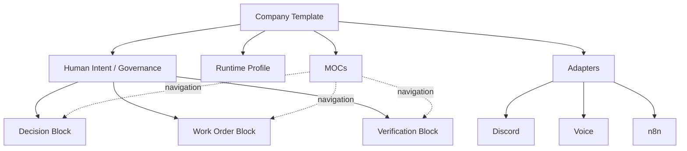
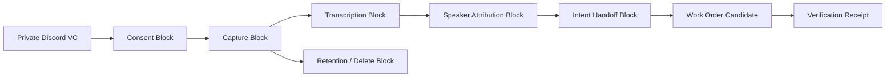

# Company Template / Blocks / MOCs の使い方

Kotodama のテンプレートは、AIに会社を丸ごと任せるための完成品ではありません。人間の意図、権限、実行、検証を見失わずに、会社やプロジェクトの運営方法を再利用するための部品です。

この文書では、会話で使われていた「Mox」を **MOCs（Maps of Content、モックス）** と解釈しています。MOCは複数の文書やBlockへ案内する地図であり、データの正本ではありません。

## 4つのテンプレート層

| 層 | 役割 | たとえるなら |
|---|---|---|
| Company Template | 会社・チーム全体の運営構造を複製する | 建物全体の設計図 |
| Block | 入力・出力・権限・検証を持つ小さな再利用部品 | 部屋や設備 |
| MOC | 関係する文書とBlockを目的別に案内する | 館内案内図 |
| Governed Record | Block出力の必須field、owner、検証・保持境界を定義する | 監査可能な伝票 |



## 理想としての使い方

### 1. Company Templateを選ぶ

最初に、誰が何のために使う会社・チームなのかを決めます。その上で実行環境を選びます。

- Minimum profile: 1台のPCとDocker Composeで試す
- Segmented profile: Proxmox上でVoice、DB、workflow、AIを分離する

Company Templateには、Human Intent、Decision、Work Order、Capability Grant、Verification Receipt、Promotion、Current Truthの置き場所と関係を含めます。

### 2. 必要なBlockだけを組み合わせる

Blockは、一つの責任を持つ小さなテンプレートです。すべてのBlockは、少なくとも次を宣言します。

- 何を入力として受け取るか
- 何を出力するか
- 誰の権限で動くか
- 何をしてはいけないか
- 何をもって成功とするか
- 失敗時にどう停止・rollbackするか
- どのreceiptを残すか

たとえばVoiceでは、Capture、Consent、Transcription、Speaker Attribution、Intent Handoff、Retention/Deleteを別Blockとして扱います。文字起こしできたことだけで、公開・保存・再利用の権限を得ることはありません。

### 3. MOCで仕事の入口を作る

MOCは「この仕事を始めるとき、何をどの順番で読むか」を示します。

例:

- Company Operations MOC
- Voice Operations MOC
- Public Release MOC
- Incident / Recovery MOC
- Venture / Customer Discovery MOC

MOCからDecisionやCurrent Truthを直接変更しません。MOCはリンクと現在地を示すProjectionです。

公開starterでは、同じcanonical Block鎖に対して3つの入口を用意しています。

| MOC | 使う場面 | 現在の範囲 |
|---|---|---|
| Company Operations | 全体の流れを最初から読む | 9 Blockの完全な読み順 |
| Public Release Review | 公開候補をDecisionから検証する | Human DecisionからPromotion Decisionまでの部分列 |
| Incident / Recovery | boundedな停止・復旧候補を辿る | Work OrderからVerification Receiptまでの部分列 |

目的別MOCは新しい記録や正本を持ちません。公開例は`projection: flow_subsequence`を明示し、manifest IDから始まり、canonical flowと同じ順序のBlockだけを参照することをvalidatorが確認します。

### 4. すべてを同じ証拠鎖に通す

```text
Source Evidence
  -> Intent Candidate
  -> Human or Policy Decision
  -> Work Order + Capability Grant
  -> Change Candidate
  -> Verification Receipt
  -> Promotion
  -> Current Truth
```

会話、Discord投稿、音声、Notion、Obsidianは入口や表示面として使えますが、それだけでDecisionやCurrent Truthにはなりません。

各Blockの`outputs`は、manifestの`records`にあるGoverned Recordの`artifact`へ一対一で接続します。公開starterでは9種を用意していますが、これは本番データではなく記録契約です。Work OrderとCapability Grant、Promotion CandidateとHuman Promotion Decisionを別Recordにし、権限と判断を暗黙に補完しません。詳細は[Governed Record Catalog](../templates/records/README.md)を参照してください。

### 5. 検証できる状態で配布する

完成したテンプレートは、READMEだけではなく、schema、validator、test、runbook、サンプル、rollback手順を一緒に配布します。秘密情報は値ではなく参照名やplaceholderに置き換えます。

## Voiceから仕事になるまでの例



理想形では、15分ごとのrotationと投稿、話者情報、handoff、削除期限が同じrun IDで追跡できます。失敗した場合は後段へ進まず、何が実行されなかったかもreceiptに残します。

## 現在は実際にどうしているか

### 公開リポジトリで使えるもの

- プロジェクトの目的、現在状態、ロードマップ
- このテンプレート利用ガイド
- Source Intake、Intent Candidate、Human Decision、Work Order、Capability Grant、Change Execution、Verification Receipt、Promotion Gate、Promotion Decisionを含むCompany starter
- Company Operations、Public Release Review、Incident / Recoveryの3つのnavigation-only MOC
- sourceを保ったまま22文書を`draft`化するinitializer、置換・review・evidenceを分離するcustomization checker、review対象bytesを固定して再照合するbundle builder/verifier
- Company manifest、Block、MOC、Governed Recordのschema、validator、negative tests
- Compose minimum / Proxmox segmentedの6フェーズinstallation lifecycle契約、validator、公開runbook

これらは構造検証できるstarterです。runtime profileは何を証拠として集めるかを定義しましたが、まだclean installできるCompany OS一式やlive receiptではありません。実際の使い始め方は[Starter Walkthrough](STARTER-WALKTHROUGH.md)、runtime境界は[Installation Lifecycle Profiles](INSTALLATION-LIFECYCLE.md)を参照してください。

### ローカルで実装・検証しているもの

- 合成Discord textまたは正規化済みの合成voice transcriptを入力にしたCompany OSの垂直スライス
- Source RecordからIntent Candidate、idea、review、Work Order candidate、zero-effect preview、Verification Receiptまでの処理
- session、requirement、plan、taskといった階層テンプレート
- Discord onboarding、Voice Adapter、Clone Birth、Agent Foundry、activity projectionの候補実装
- 同じ入力のreplay、改ざん検出、明示stop、外部通信0の安全検証

このローカル実装はsynthetic/private dogfoodです。公開稼働、実顧客運用、自律会社の完成を意味しません。

### まだ公開テンプレートになっていないもの

- secret-freeなHuman IntentからPromotionまでの全テンプレートpack
- executableなDocker Compose service manifestとclean-install receipt
- exact Proxmox candidateのclean install / restart / restore receipt
- PostgreSQL Company DBとEvidence Storeの再現可能な導入
- Discord、Voice、n8nの実provider E2E
- Human Intent、Decision、Capability Grant、Verification Receipt、Promotionなどplanned catalog全体のschema・validator・test
- 実音声の15分rotation、投稿、保持、削除の公開可能な証明

Company manifest、Block、MOCに限定した最小validatorとnegative testは現在公開済みです。これはplanned catalog全体の完成を意味しません。

## 現時点での使い方

1. [テンプレートカタログ](../templates/README.md)から目的に近いstarterを選ぶ。
2. initializerで[Company starter](../examples/company-starter/README.md)の`draft`作業copyを作る。
3. `compose_minimum`または`proxmox_segmented`を選び、[installation lifecycle](INSTALLATION-LIFECYCLE.md)の契約例を検証する。
4. [customization checker](CUSTOMIZATION-CHECKLIST.md)で、置換19件、review 46件、別evidence 5件を分けて確認する。
5. placeholderを自分の組織用の参照名へ置き換える。tokenや個人情報の値は書かない。
6. [review bundle](REVIEW-BUNDLE.md)を作り、manifest、Blocks、MOCs、Recordsのexact bytesを固定する。
7. [review workflow](REVIEW-WORKFLOW.md)でsaved bundleを再照合し、Decisionを別Recordへ束縛する。
8. Blockごとにowner、authority、denied actions、verification、rollbackをreviewする。
9. Company Operations、Public Release Review、Incident / RecoveryのMOCから、目的に合う入口を選ぶ。
10. validatorとcheckerを通し、実行後にsource revisionと結果を照合する。
11. 独立した承認がある場合だけ、別のgoverned processでPromotionする。

## Statusの読み方

| 表記 | 意味 |
|---|---|
| `example` | 書き方の例。実行対象ではない |
| `draft` | 編集中 |
| `candidate_only` | 検証候補。Current Truthではない |
| `locally_verified` | 限定scopeのローカル検証済み |
| `deployed` | 対象revisionの配備receiptあり |
| `promoted` | 定められた承認と検証を経てCurrent Truthへ反映済み |

名前に`full`、`complete`、`all`が含まれていても、scopeとreceiptがなければ完成の証明にはしません。
